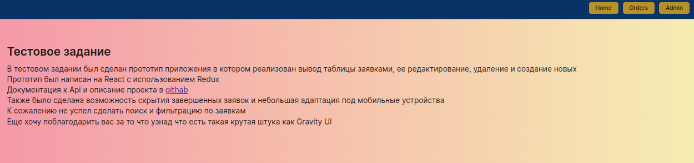
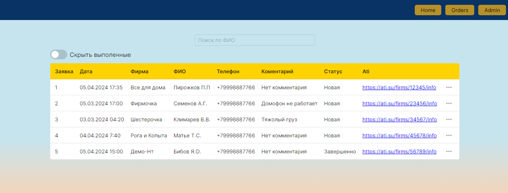
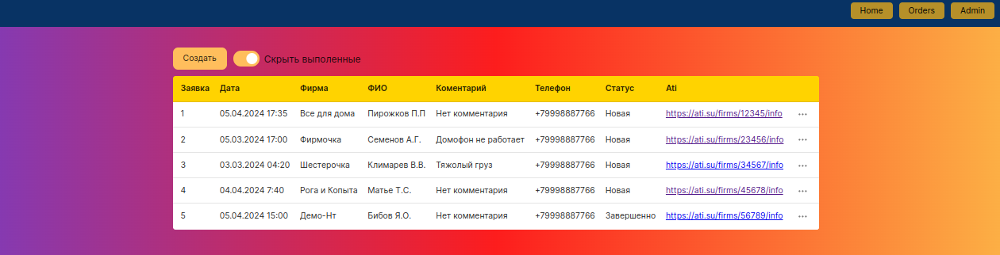

# Тестовое задание 

Ссылка на  развернутый проект https://app.netlify.com/sites/meek-pudding-0aadee/overview

## Как запустить

После клонирование перейти  в его репозиторий установить все зависимости -npm i, после этого запустить проект - npm run dev

Страница откроется на  http://localhost:5173/

Приложение начинается с домашней страницы где, есть переход на домашнюю страницу для просмотра данных , и переход на страницу администратора для редактирования данных

## Как организованно приложение
Приложение имеет три странницы
### Home 
Небольшое описание проекта
  
### User
Страница с заявками в которых можно завершить заявку и скрыть выполненные 
Здесь используется компонент таблица userTable 
  
### Admin
Страницы с заявками в которых можно полноценно создавать , редактировать и удалять заявки
Здесь используется компонент таблица adminTable и окно для создания новых заявок modalCreate а также окно для редактирования заявок modalUpdate 
  

## Redux
В приложении используется redux toolkit с тремя редюсерами
## orderSlice 
 Данные  для заявок и методы для из создания, удаления, обновления и завершения
## selectedOrderSlice 
 Данные редактируемой заявки для передачи в компонент modalUpdate
## numberOrder
 Количество заявок и метод для увеличения

# Как я вижу APi

Добавление заявки
### POST/application

Удаление записи по id
### DELETE/id

Получение всех заявок 
### GET/?UserName

Получение одной по ID ил ATI коду
### GET/id
### GET/ATI

Изменение существующей записи по id
### PUT/id

## Стек приложения 

Для создания приложения был использован React 18 версии, в качестве state-менаджера был использован Redux Toolkit. Также были использованны различные компоненты из фреймворка Gravity UI.В приложении также используются Typescript и sass для работы с css.

## Сколько времени ушло на выполнение

Времени было потрачено около 15-17 часов
